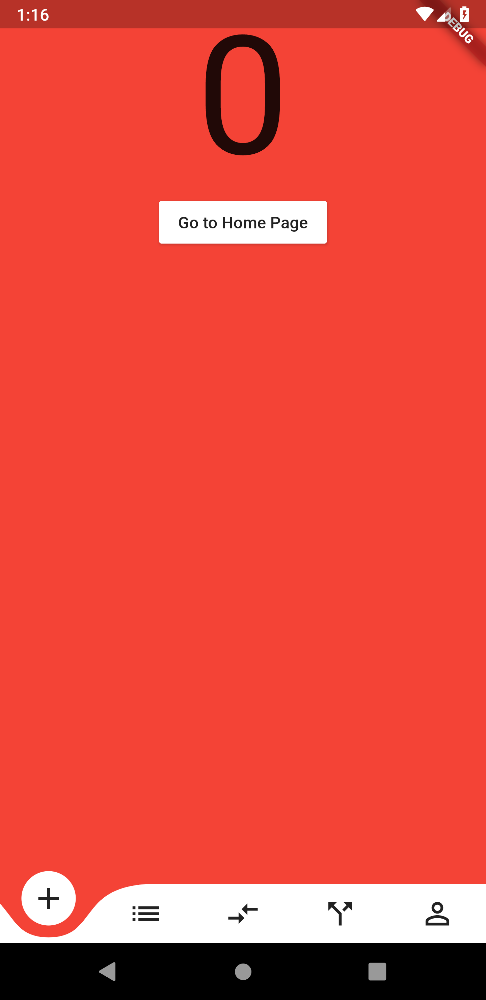
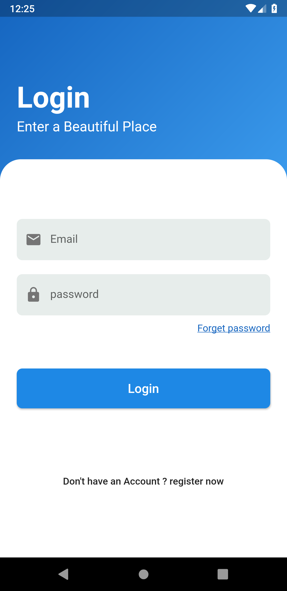

# Flutter Demo Projects for Learning Purpose

all of my flutter learning projects

| Day   | Project Name              | ScreenShot                                     | Code                                               | Remarks                                         |
| ----- | ----------------          | ---------------------------------------------- | --------------------------------------             | ----------------------------------------------- |
| Day 1 | Flutter App               |          | [flutter_app](./flutter_app)                       | First flutter app                               |
| Day 2 | Flutter by Learn24        |           | [flutter_by_learn_24](./flutter_by_learn_24)       | All source code of learn24 youtube tutorials    |
| Day 3 | Login and SignUp          |     | [login_and_signup](./login_and_signup)             | Simple Login and SignUp UI                      |
| Day 4 | Onboarding Liquid Swap    |      | [onboarding_liquid_swap](./onboarding_liquid_swap) | Onboarding liquid swaping slider                |
| Day 5 | Booking App               |      | [booking_app](./booking_app)                       | Simple hotel booking app                        |
| Day 6 | Curved Navigation Bar     |       | [curved_navigation_bar](./curved_navigation_bar)   | Beautiful curved navigation bar                 |
| Day 7 | Beautiful Login & Signup  |        | [beautiful_login_signup](./beautiful_login_signup)                  | Beautiful Login and Signup UI                    |
| Day 8 | Basic Login UI            | .jpg) | [basic_login_ui](./basic_login_ui)                   | Basic Login UI                               |
